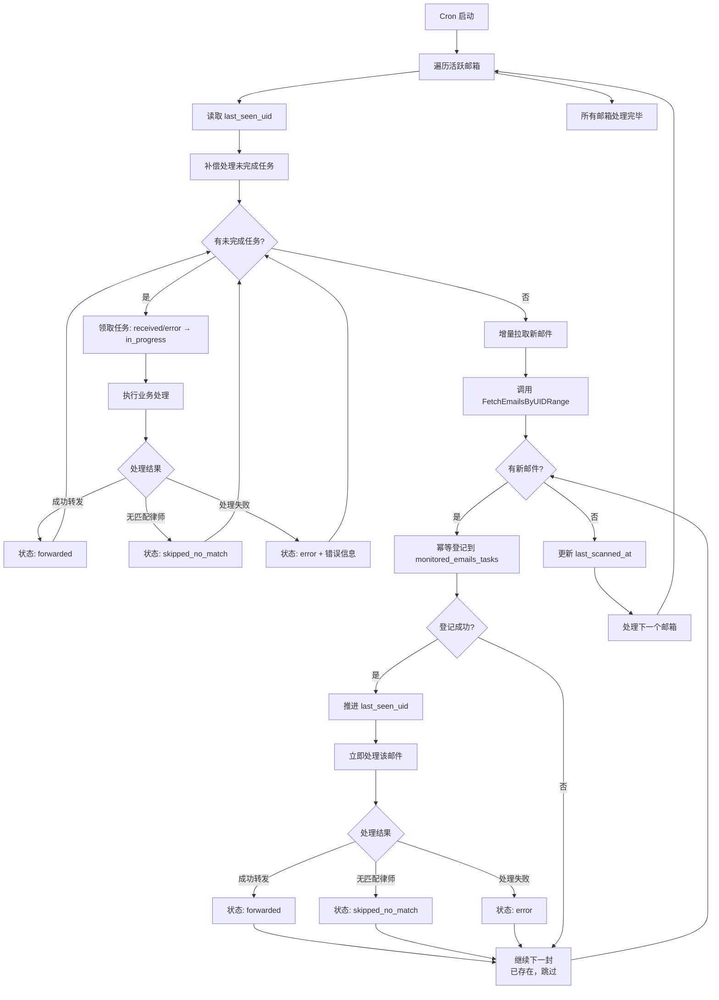
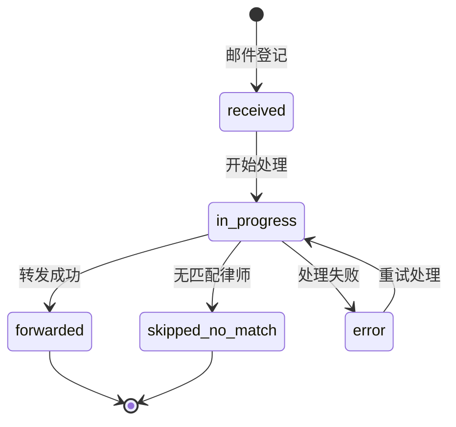

# 邮件监控幂等转发方案 - 简化版

## 目标

- **不遗漏**：基于 IMAP UID 增量拉取，直到追平最新 UID
- **不重复**：处理幂等（同一封邮件只处理一次），异常重启后不重复且能恢复继续

## 总体方案概览

- **增量游标**：使用 IMAP `UID`，在同一邮箱内单调递增，32 位足够业务使用
- **状态存储**：在现有 `monitored_emails` 表增加游标字段，新增 `monitored_emails_tasks` 表作为任务队列
- **单进程处理**：暂不考虑并发锁，假设任务在单进程中执行
- **流程**：补偿处理未完成任务 → 增量拉取新邮件 → 幂等登记 → 业务处理

## 数据模型

### monitored_emails 表（新增字段）

```sql
CREATE TABLE `monitored_emails` (
  `id` INT UNSIGNED NOT NULL AUTO_INCREMENT,
  `email_address` VARCHAR(255) NOT NULL UNIQUE,
  `email_password` VARCHAR(255) NOT NULL,
  `description` TEXT,
  `is_active` BOOLEAN NOT NULL DEFAULT TRUE,
  `last_seen_uid` BIGINT NOT NULL DEFAULT 0,
  `last_scanned_at` DATETIME(6) NULL,
  `created_at` DATETIME(6) NOT NULL DEFAULT CURRENT_TIMESTAMP(6),
  `updated_at` DATETIME(6) NOT NULL DEFAULT CURRENT_TIMESTAMP(6) ON UPDATE CURRENT_TIMESTAMP(6),
  PRIMARY KEY (`id`)
)
```

### monitored_emails_tasks 表（任务队列）

```sql
CREATE TABLE monitored_emails_tasks (
  `id` INT UNSIGNED NOT NULL AUTO_INCREMENT,
  inbox_email VARCHAR(320) NOT NULL,
  uid INT UNSIGNED NOT NULL, 
  subject TEXT,
  email_date DATETIME(6) COMMENT '邮件发送时间',
  status ENUM('received','in_progress','forwarded','skipped_no_match','error') NOT NULL DEFAULT 'received',
  attempt_count INT NOT NULL DEFAULT 0,
  error_message TEXT,
  created_at DATETIME(6) NOT NULL DEFAULT CURRENT_TIMESTAMP(6),
  updated_at DATETIME(6) NOT NULL DEFAULT CURRENT_TIMESTAMP(6) ON UPDATE CURRENT_TIMESTAMP(6),

  PRIMARY KEY (`id`),
  UNIQUE KEY uk_inbox_email (inbox_email),
  UNIQUE KEY uk_mail_uid (inbox_email, uid),
  KEY idx_pending (inbox_email, status, id)
)
```

## 处理流程图



## 核心接口设计

### 增强的 IncomingEmail

```go
type IncomingEmail struct {
    UID         uint32
    MessageID   string
    From        string
    To          string
    Subject     string
    Body        string
    Raw         []byte
    Date        time.Time // 邮件发送时间（从 Envelope.Date 获取）
}
```

### 基于 UID 的分页拉取

```go
// 按 UID 增量拉取，返回邮件列表和是否还有更多
func FetchEmailsByUIDRange(username, password string, startUID uint32, limit int) (
    emails []IncomingEmail,
    hasMore bool,
    err error,
)
```

实现要点：
1. 使用 `UidSearch` 查找 `UID > startUID` 的邮件
2. 限制返回数量为 `limit`
3. 使用 `UidFetch` 批量获取邮件详情

## 幂等处理逻辑

### 幂等登记

```go
// 尝试登记新邮件，返回是否为新邮件
func RegisterTask(email IncomingEmail, inboxEmail string) (isNew bool, err error) {
    _, err = db.Exec(`
        INSERT INTO monitored_emails_tasks 
        (inbox_email, uid, subject, email_date, status) 
        VALUES (?, ?, ?, ?, 'received')
        ON DUPLICATE KEY UPDATE id=id
    `, inboxEmail, email.UID, email.Subject, email.Date)
    
    if err != nil {
        return false, err
    }
    
    // 检查是否真的插入了新记录
    return checkIfNewlyInserted(inboxEmail, email.UID)
}
```

### 任务处理状态流转



## 错误处理与重试

### 重试策略

- `error` 状态的任务会在下次补偿处理中重新尝试
- 可根据 `attempt_count` 实现简单的重试限制（如最多3次）
- 永久性错误（如律师邮箱缺失）直接标记为 `skipped_no_match`

### 补偿处理查询

```sql
SELECT * FROM monitored_emails_tasks
WHERE inbox_email = ? 
  AND status IN ('received', 'error')
  AND attempt_count < 3
ORDER BY id ASC
LIMIT 10;
```

## 监控指标

- **处理量**：每轮成功/跳过/失败的邮件数量
- **延迟**：`当前最大UID - last_seen_uid`（积压量）
- **重试率**：`error` 状态任务的比例
- **处理时长**：每轮 cron 执行耗时

## 实施步骤

### 第一阶段：数据库和 ORM 基础设施

1. **数据库表创建**
   - 执行 `monitored_emails` 表创建 SQL（已包含游标字段）
   - 执行 `monitored_emails_tasks` 表创建 SQL

2. **ORM 实体定义**
   ```go
   // internal/biz/monitored_emails.go
   type MonitoredEmailsEntity struct {
       ID              uint32    `gorm:"primaryKey;autoIncrement"`
       EmailAddress    string    `gorm:"uniqueIndex;size:255;not null"`
       EmailPassword   string    `gorm:"size:255;not null"`
       Description     string    `gorm:"type:text"`
       IsActive        bool      `gorm:"default:true;not null"`
       LastSeenUID     uint64    `gorm:"default:0;not null"`
       LastScannedAt   *time.Time `gorm:"type:datetime(6)"`
       CreatedAt       time.Time `gorm:"autoCreateTime"`
       UpdatedAt       time.Time `gorm:"autoUpdateTime"`
   }

   type MonitoredEmailsTasksEntity struct {
       ID           uint64    `gorm:"primaryKey;autoIncrement"`
       InboxEmail   string    `gorm:"size:320;not null;index:uk_mail_uid,priority:1"`
       UID          uint64    `gorm:"not null;index:uk_mail_uid,priority:2,unique"`
       Subject      string    `gorm:"type:text"`
       EmailDate    *time.Time `gorm:"type:datetime(6);index"`
       Status       string    `gorm:"type:enum('received','in_progress','forwarded','skipped_no_match','error');default:'received';not null"`
       AttemptCount int       `gorm:"default:0;not null"`
       ErrorMessage string    `gorm:"type:text"`
       CreatedAt    time.Time `gorm:"autoCreateTime;type:datetime(6)"`
       UpdatedAt    time.Time `gorm:"autoUpdateTime;type:datetime(6)"`
   }
   ```

3. **数据访问层方法**
   ```go
   // MonitoredEmailsUsecase 新增方法
   func (uc *MonitoredEmailsUsecase) UpdateLastSeenUID(id uint32, uid uint64) error
   func (uc *MonitoredEmailsUsecase) UpdateLastScannedAt(id uint32) error
   
   // MonitoredEmailsTasksUsecase 新增
   type MonitoredEmailsTasksUsecase struct {
       data *Data
       log  *log.Helper
   }
   
   func (uc *MonitoredEmailsTasksUsecase) RegisterTask(email IncomingEmail, inboxEmail string) (bool, error)
   func (uc *MonitoredEmailsTasksUsecase) GetPendingTasks(inboxEmail string, limit int) ([]*MonitoredEmailsTasksEntity, error)
   func (uc *MonitoredEmailsTasksUsecase) UpdateStatus(id uint64, status string, errorMsg string) error
   func (uc *MonitoredEmailsTasksUsecase) IncrementAttempt(id uint64) error
   ```

### 第二阶段：邮件接收器增强

4. **增强 email_receiver.go**
   - 保留现有 `FetchRecentEmailsForInbox` 函数（用于初始化）
   - 新增基于 UID 的增量拉取函数
   - 新增补偿处理函数

   ```go
   // 新增函数列表
   func FetchEmailsByUIDRange(username, password string, startUID uint32, limit int) ([]IncomingEmail, bool, error)
   func FetchEmailByUID(username, password string, uid uint32) (*IncomingEmail, error)
   func GetMailboxUIDNext(username, password string) (uint32, error)
   ```

   **实现要点**：
   - `FetchEmailsByUIDRange`: 使用 `UidSearch` + `UidFetch` 实现分页拉取
   - `FetchEmailByUID`: 直接通过 UID 获取单封邮件
   - `GetMailboxUIDNext`: 获取邮箱的 UIDNext 值，用于判断是否有新邮件
   - 所有函数复用现有的连接逻辑（包括代理设置）

5. **更新 IncomingEmail 结构**
   ```go
   type IncomingEmail struct {
       UID         uint32
       MessageID   string
       From        string
       To          string
       Subject     string
       Body        string
       Raw         []byte
       Date        time.Time // 从 msg.Envelope.Date 获取
   }
   ```

### 第三阶段：任务处理逻辑重构

6. **重构 monitored_emails_job.go**
   - 修改 `Handle()` 方法主流程
   - 新增补偿处理逻辑
   - 新增幂等登记逻辑
   - 保持现有转发逻辑不变

   **主要变更**：
   ```go
   func (c *MonitoredEmailsJobUsecase) Handle() error {
       // 1. 加载活跃邮箱
       activeInboxes, err := c.MonitoredEmailsStore.ListActive()
       
       for _, inbox := range activeInboxes {
           // 2. 补偿处理未完成任务
           if err := c.processCompensationTasks(inbox); err != nil {
               c.log.Errorf("compensation failed: %v", err)
           }
           
           // 3. 增量拉取新邮件
           if err := c.processNewEmails(inbox); err != nil {
               c.log.Errorf("process new emails failed: %v", err)
           }
           
           // 4. 更新扫描时间
           c.MonitoredEmailsStore.UpdateLastScannedAt(inbox.ID)
       }
   }
   
   func (c *MonitoredEmailsJobUsecase) processCompensationTasks(inbox *MonitoredEmailsEntity) error
   func (c *MonitoredEmailsJobUsecase) processNewEmails(inbox *MonitoredEmailsEntity) error
   func (c *MonitoredEmailsJobUsecase) processEmail(email IncomingEmail, inbox *MonitoredEmailsEntity) error
   ```

7. **初始化处理逻辑**
   - 当 `LastSeenUID = 0` 时，使用现有 `FetchRecentEmailsForInbox(1)` 获取最新一封邮件
   - 处理完成后，将该邮件的 UID 设置为 `LastSeenUID`
   - 后续轮次使用增量拉取

### 第四阶段：集成和测试

8. **依赖注入更新**
   - 在 `wire.go` 中添加 `MonitoredEmailsTasksUsecase` 的依赖注入
   - 更新 `MonitoredEmailsJobUsecase` 的构造函数

9. **单元测试**
   - `email_receiver_test.go`: 测试 UID 相关函数
   - `monitored_emails_tasks_test.go`: 测试幂等登记逻辑
   - `monitored_emails_job_test.go`: 测试补偿和增量处理

10. **集成测试**
    - 验证完整的端到端流程
    - 测试异常重启恢复场景
    - 验证幂等性保证

### 实施注意事项

- **向后兼容**: 保留现有函数，确保不影响其他调用方
- **错误处理**: 每个阶段都要有完善的错误处理和日志记录
- **性能考虑**: UID 拉取时合理设置 `limit`，避免一次拉取过多邮件
- **数据一致性**: 使用事务确保游标更新和邮件登记的原子性

---

graph TD
    A[Cron 启动] --> B[遍历活跃邮箱]
    B --> C[补偿处理未完成任务]
    C --> D[增量拉取新邮件]
    D --> E[更新扫描时间]
    E --> F[下一个邮箱]
    F --> B
    
    C --> C1[获取pending任务]
    C1 --> C2[标记in_progress]
    C2 --> C3[通过UID获取邮件]
    C3 --> C4[处理邮件]
    C4 --> C5[更新任务状态]
    
    D --> D1{LastSeenUID=0?}
    D1 -->|是| D2[初始化：获取最新邮件]
    D1 -->|否| D3[增量拉取新邮件]
    D2 --> D4[注册和处理邮件]
    D3 --> D4
    D4 --> D5[更新LastSeenUID]